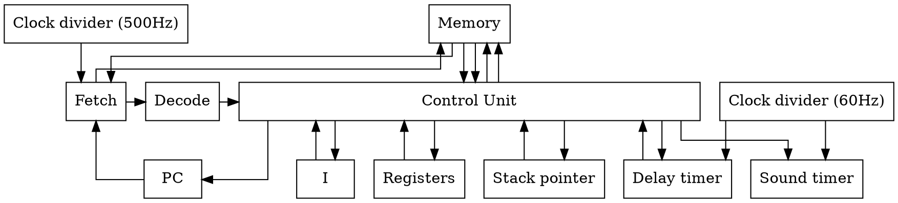

# System architecture

## Components
### Registers and memory
| Label         | Name |
| ---------     | -----                               |
| Clock divider | Should run at 500Hz             |
| I             | Address Register (16 bit)           |
| PC            | Instruction Pointer                 | 
| Registers     | 16 8-bit registers                  |
| Stack         | Stack pointer for function return addresses.   The stack is saved in RAM  |
| Delay Timer   | Read-write timer which decrements to 0 at 60 Hz. |
| Sound Timer   | Write-only timer which decrements to 0 at 60 Hz. If the value is nonzero, a sound will play. |
| ALU           | Uses VF as status register. 1x 8-bit operand, 1x 16-bit operand, 1x 16-bit output. |

### Logical
#### Fetch 
Fetches the instruction at memory location PC
#### Decode
Decodes the instruction into operation, registers, addresses
#### Control Unit
Executes the instruction and writes results back to memory and registers

